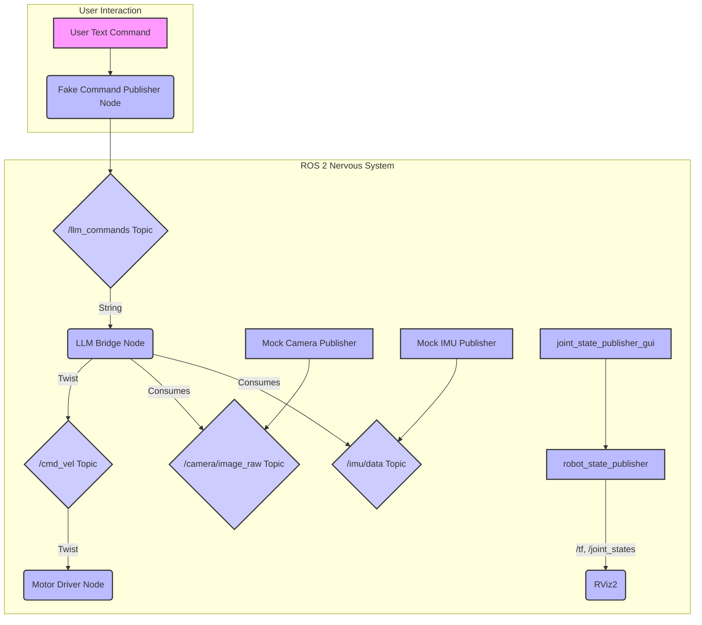

# Section 7: Putting It All Together – A Mini System Example

In the preceding sections, we've explored the fundamental building blocks of a robot's nervous system using ROS 2: nodes, topics, services, actions, and URDF. We've also seen how to bridge Python AI agents with ROS 2 controllers. Now, let's integrate these concepts into a simple, runnable mini system example that demonstrates a complete (though simplified) AI-to-robot control loop.

## 7.1. The Mini System Goal

Our mini system will demonstrate:
1.  A mock AI agent (our `llm_bridge_node`) receiving a simple text command.
2.  The `llm_bridge_node` translating this text command into a ROS 2 `geometry_msgs/Twist` message.
3.  A mock motor driver (`motor_driver_node`) subscribing to this `Twist` message and acting upon it.
4.  Mock sensors (`camera_publisher_node`, `imu_publisher_node`) publishing data.
5.  A URDF model of our humanoid robot visualized in RViz2, showing how the robot's state changes (conceptually) based on commands.

## 7.2. System Architecture Overview



## 7.3. Launching the Mini System

To run this mini system, we'll use a single launch file that brings up all the necessary nodes.

### 1. Build Your ROS 2 Workspace

Ensure all packages have been built after creating the necessary `setup.py` files for Python packages and modifying `package.xml` for `my_robot_bringup`:

```bash
# Navigate to your workspace root
cd ~/vla_ws # Or your chosen workspace
colcon build --symlink-install
source install/setup.bash
```

### 2. The Launch File (`robot_system.launch.py`)

For this integrated example, let's create a new launch file in `my_robot_bringup/launch/robot_system.launch.py`. This consolidates the nodes we've developed:

```python
# code-examples/01-nervous-system/ros2_ws/src/my_robot_bringup/launch/robot_system.launch.py
import os
from ament_index_python.packages import get_package_share_directory
from launch import LaunchDescription
from launch_ros.actions import Node

def generate_launch_description():
    urdf_tutorial_share_dir = get_package_share_directory('urdf_tutorial')
    urdf_path = os.path.join(urdf_tutorial_share_dir, 'urdf', 'humanoid.urdf')

    rviz_config_dir = os.path.join(urdf_tutorial_share_dir, 'rviz', 'urdf.rviz')

    return LaunchDescription([
        # Robot State Publisher reads URDF and publishes /tf
        Node(
            package='robot_state_publisher',
            executable='robot_state_publisher',
            name='robot_state_publisher',
            output='screen',
            parameters=[{'robot_description': open(urdf_path).read()}],
            arguments=[urdf_path]
        ),

        # Joint State Publisher GUI for manipulating URDF joints in RViz2
        Node(
            package='joint_state_publisher_gui',
            executable='joint_state_publisher_gui',
            name='joint_state_publisher_gui',
            output='screen'
        ),

        # RViz2 for visualizing the robot model and sensor data
        Node(
            package='rviz2',
            executable='rviz2',
            name='rviz2',
            output='screen',
            arguments=['-d', rviz_config_dir]
        ),

        # Mock Camera Publisher
        Node(
            package='ros2_py_sensors',
            executable='camera_publisher_node',
            name='camera_publisher',
            output='screen'
        ),

        # Mock IMU Publisher
        Node(
            package='ros2_py_sensors',
            executable='imu_publisher_node',
            name='imu_publisher',
            output='screen'
        ),

        # LLM Bridge Node (AI agent proxy)
        Node(
            package='ros2_py_agent',
            executable='llm_bridge_node',
            name='llm_bridge_node',
            output='screen'
        ),

        # Motor Driver Node (Robot controller proxy)
        Node(
            package='ros2_py_controllers',
            executable='motor_driver_node',
            name='motor_driver_node',
            output='screen'
        ),
    ])
```
*Make sure to build your workspace after adding this new launch file.*

### 3. Launch the System

```bash
ros2 launch my_robot_bringup robot_system.launch.py
```

This command will:
-   Start `robot_state_publisher` and `joint_state_publisher_gui` to visualize your `humanoid.urdf` in RViz2.
-   Launch RViz2 with the basic configuration.
-   Start the mock camera and IMU publishers, which will continuously send data.
-   Initiate the `llm_bridge_node` listening for commands.
-   Start the `motor_driver_node` listening for `Twist` commands.

### 4. Sending Commands to the AI Agent

Open a **new terminal** (and remember to source your ROS 2 environment: `source install/setup.bash`) and send a text command to the `llm_bridge_node` using `ros2 topic pub`:

```bash
ros2 topic pub /llm_commands std_msgs/msg/String "data: 'move forward 0.5 meter'" -1
```
Or:
```bash
ros2 topic pub /llm_commands std_msgs/msg/String "data: 'turn left 45 degrees'" -1
```
Or:
```bash
ros2 topic pub /llm_commands std_msgs/msg/String "data: 'stop'" -1
```

Observe the output in the terminal where `robot_system.launch.py` is running:
-   The `llm_bridge_node` should report receiving the command and publishing a `Twist` message to `/cmd_vel`.
-   The `motor_driver_node` should report receiving the `Twist` message and interpret it (e.g., "Moving forward...", "Turning left...", "Stopping motors.").

This mini system demonstrates a closed-loop conceptual pipeline: a high-level command is translated by an AI proxy, sent over ROS 2, and received by a low-level controller proxy, all while sensors are publishing data that could be consumed for more complex AI tasks. It forms the basic nervous system for our humanoid robot.
