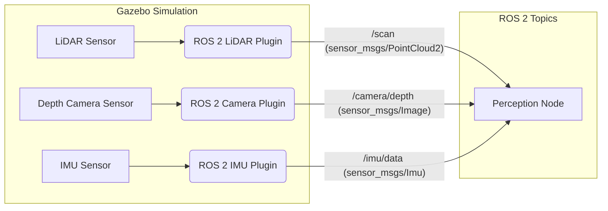

# Implementation Plan: The Digital Twin (Gazebo & Unity)

**Feature Branch**: `002-digital-twin-sim`
**Created**: 2025-12-09

## 1. ARCHITECTURE SKETCH

### High-Level Conceptual Architecture

This module details the creation of a dual-engine digital twin for humanoid robotics, leveraging **Gazebo** for physics-based simulation and **Unity** for high-fidelity rendering and human-robot interaction.

-   **Dual-engine digital twin pipeline**:
    -   **Gazebo** for physics, collisions, gravity, actuator dynamics: This open-source simulator provides realistic physics interactions, essential for robot control and dynamics testing. It will handle the backend simulation where the robot's physical behavior is computed.
    -   **Unity** for high-fidelity visuals, human-robot interaction, cinematic rendering: Unity will serve as the frontend, providing a visually rich environment for displaying the robot's state and facilitating intuitive human-robot interaction. Its advanced rendering capabilities allow for realistic visual feedback.

-   **How the humanoid robot URDF flows into Gazebo simulation**: The URDF (Unified Robot Description Format) defined in Module 1 will be converted or adapted to be compatible with Gazebo. This typically involves using SDF (Simulation Description Format) or Gazebo-specific URDF extensions that incorporate physics properties, sensor plugins, and actuator configurations.

-   **How Unity imports models for high-detail rendering (glTF/Fbx pipeline)**: Humanoid robot models, potentially derived from the same CAD source as the URDF, will be imported into Unity using standard 3D asset formats like FBX or glTF. These models will be set up with Unity's rendering pipelines (URP/HDRP) for realistic appearance.

-   **Message interfaces**:
    -   **ROS → Gazebo (control, sensors)**: ROS 2 will serve as the primary communication middleware. Control commands (e.g., joint torques, velocities) will be sent from ROS 2 nodes to the Gazebo simulation. Gazebo's sensor data (e.g., LiDAR, camera, IMU) will be published to ROS 2 topics, making it available to perception and control algorithms.
    -   **ROS → Unity (via ROS–TCP–Connector or custom bridge)**: ROS 2 will communicate with Unity to synchronize the robot's state (e.g., joint positions, poses) for high-fidelity visualization. This will primarily be achieved using the `ROS-TCP-Connector`, a Unity package that facilitates ROS 2 communication over TCP, or a custom Python-based bridge if more specific requirements arise.

-   **Sensor simulation architecture**:
    -   **LiDAR**: Simulated using raycasting engines within Gazebo, generating point cloud data that mimics real LiDAR outputs. Noise models will be applied to add realism.
    -   **Depth camera**: Simulated using GPU render pipelines (e.g., shaders that output depth values) in Gazebo, generating depth images that approximate real depth sensors.
    -   **IMU**: Simulated by integrating physics data (acceleration, angular velocity, orientation) from Gazebo with noise models to replicate real-world IMU characteristics.
    -   Each simulated sensor will publish its data to a dedicated ROS 2 topic in a standard message format (e.g., `sensor_msgs/Image`, `sensor_msgs/PointCloud2`, `sensor_msgs/Imu`).

### Diagram-Level Description

#### Block Diagram of Two-Engine Simulation

```mermaid
graph TD
    subgraph Robot Brain (ROS 2 Control & Perception)
        A[AI Agent Node] --> B(Controller Node)
        B --> C(Perception Node)
    end

    subgraph Simulation Engines
        subgraph Gazebo (Physics Backend)
            D[Humanoid Robot Model (SDF)]
            E[Physics Engine (ODE/Bullet)]
            F[Simulated Sensors (LiDAR, Camera, IMU)]
            D -- Joint Commands --> E
            E -- Physics Updates --> D
            E -- Raw Sensor Data --> F
        end

        subgraph Unity (Rendering Frontend)
            G[Humanoid Robot Model (FBX/glTF)]
            H[High-Fidelity Renderer (HDRP/URP)]
            I[Interactive UI]
            G -- Visuals --> H
            H -- Rendered Output --> I
        end
    end

    B -- Joint Commands (ROS Topic) --> D
    F -- Sensor Data (ROS Topic) --> C
    D -- State Sync (ROS Topic) --> G
    G -- Control Input (ROS Topic) --> B
    I -- User Input --> G
```

**Description**:
The ROS 2 Control & Perception layer acts as the "brain," sending high-level commands to Gazebo for physics simulation and receiving processed sensor data. Gazebo simulates the robot's physical behavior and generates raw sensor data. This data, along with robot state, is sent back to ROS 2. Unity receives robot state updates from ROS 2 to render a high-fidelity visual representation and allows for interactive control, which is then fed back to ROS 2.

#### Data-flow Graph for Sensors → ROS Topics



**Description**:
Sensors within the Gazebo simulation (LiDAR, Depth Camera, IMU) utilize ROS 2 plugins to publish their simulated data to respective ROS 2 topics (`/scan`, `/camera/depth`, `/imu/data`). A perception node in ROS 2 subscribes to these topics to process the sensor information.

#### Feedback Loop between Simulation and Agent Controllers

```mermaid
graph LR
    A[AI Agent (ROS 2 Node)] -- Control Decisions --> B(Controller Node (ROS 2))
    B -- Joint Commands --> C[Gazebo Simulation]
    C -- Robot State (Joints, Pose) --> D[ROS 2 Robot State Publisher]
    D -- /joint_states (sensor_msgs/JointState) --> A
    D -- /tf (tf2_msgs/TFMessage) --> A
    C -- Raw Sensor Data --> E[ROS 2 Sensor Plugins]
    E -- Processed Sensor Data (Topics) --> A
```

**Description**:
The AI Agent, running as a ROS 2 node, makes control decisions and sends them to a Controller Node. The Controller Node translates these into joint commands for the Gazebo simulation. Gazebo updates the robot's state and publishes raw sensor data. ROS 2 plugins process this data and publish it to topics, which are then subscribed to by the AI Agent for closed-loop control and perception.

#### Folder & File Structure for the module inside Docusaurus

```
├── docs/
│   ├── 02-digital-twin-sim/
│   │   ├── 00-intro.md
│   │   ├── 01-gazebo-physics.md
│   │   ├── 02-unity-rendering.md
│   │   ├── 03-sensor-simulation.md
│   │   ├── 04-combined-workflow.md
│   │   ├── 05-mini-example.md
│   │   └── 06-references.md
├── static/
│   ├── img/
│   │   ├── 02-digital-twin-sim/
│   │   │   ├── dual-engine-block.excalidraw
│   │   │   ├── sensor-dataflow.excalidraw
│   │   │   ├── feedback-loop.excalidraw
│   │   │   ├── gazebo-humanoid.excalidraw
│   │   │   └── unity-humanoid.excalidraw
├── code-examples/
│   ├── 02-digital-twin-sim/
│   │   ├── gazebo_ws/
│   │   │   ├── src/
│   │   │   │   ├── humanoid_description/
│   │   │   │   │   ├── urdf/
│   │   │   │   │   │   └── humanoid_gazebo.urdf
│   │   │   │   │   ├── meshes/
│   │   │   │   │   │   └── humanoid.stl
│   │   │   │   │   ├── launch/
│   │   │   │   │   │   └── display_humanoid.launch.py
│   │   │   │   │   └── package.xml
│   │   │   │   ├── gazebo_worlds/
│   │   │   │   │   ├── worlds/
│   │   │   │   │   │   ├── lab_world.world
│   │   │   │   │   │   ├── living_room.world
│   │   │   │   │   │   └── obstacle_course.world
│   │   │   │   │   └── package.xml
│   │   │   │   └── ros2_unity_bridge_py/ # Custom Python bridge if needed
│   │   │   │       ├── ros2_unity_bridge_py/
│   │   │   │       │   └── bridge_node.py
│   │   │   │       └── package.xml
│   │   │   └── ... (build, install, log)
│   │   ├── unity_project/
│   │   │   ├── Assets/
│   │   │   │   ├── Models/
│   │   │   │   │   └── Humanoid.fbx
│   │   │   │   ├── Scenes/
│   │   │   │   │   ├── LabScene.unity
│   │   │   │   │   ├── LivingRoomScene.unity
│   │   │   │   │   └── ObstacleCourseScene.unity
│   │   │   │   └── ... (ROS-TCP-Connector, Scripts)
```

**Description**:
-   `docs/02-digital-twin-sim/`: Contains the Markdown files for each section of the module.
-   `static/img/02-digital-twin-sim/`: Stores images and diagrams for the module, including Excalidraw files.
-   `code-examples/02-digital-twin-sim/gazebo_ws/`: A ROS 2 workspace with Gazebo-specific assets (SDF/URDF, worlds, launch files) and custom ROS 2 nodes for the bridge if necessary.
-   `code-examples/02-digital-twin-sim/unity_project/`: A Unity project containing the robot models, scenes, and integration with the ROS-TCP-Connector.

## 2. SECTION STRUCTURE

This module covers:
- Physics-based simulation using Gazebo
- High-fidelity environment rendering in Unity
- Sensor simulation: LiDAR, depth cameras, IMUs
- Digital twin workflows for humanoid robotics

The complete chapter outline:

-   **Section 1 — Introduction**
    -   What is a Digital Twin? Introduce the concept of digital twins and their growing importance in robotics and AI.
    -   Why humanoid robotics require dual simulation engines: Explain the need for separate physics (Gazebo) and high-fidelity rendering (Unity) engines for complex humanoid systems.

-   **Section 2 — Gazebo Physics Simulation**
    -   Gazebo classic vs Ignition (Garden/Fortress): Overview of Gazebo versions, highlighting the chosen version and rationale (e.g., Ignition for modern features).
    -   Physics engines (ODE, Bullet, DART): Discuss the different physics engines available in Gazebo and their respective strengths/weaknesses.
    -   Gravity, friction, collisions: Explain how these fundamental physics concepts are configured and simulated in Gazebo.
    -   Actuator + joint dynamics: Detail how to model realistic motor behavior, PID control, and joint limits.
    -   Running humanoid URDF in Gazebo: Step-by-step guide on taking the URDF from Module 1 and preparing it for Gazebo (e.g., converting to SDF or adding Gazebo-specific tags).
    -   ROS 2 integration (gazebo_ros_pkgs): Explain the role of `gazebo_ros_pkgs` for connecting Gazebo to ROS 2 topics and services.

-   **Section 3 — Unity for High-Definition Rendering**
    -   Unity HDRP/URP rendering pipelines: Introduce Unity's rendering options, explaining the choice for high-fidelity visuals (e.g., HDRP).
    -   Human-in-the-loop interaction environments: Discuss how Unity can be used to create interactive user interfaces and control panels for the digital twin.
    -   Lighting, materials, real-time shadows: Guide on setting up realistic lighting, PBR materials, and real-time shadows for compelling visuals.
    -   Unity–ROS 2 bridge using ROS–TCP–Connector: Detailed instructions on setting up and using the `ROS-TCP-Connector` for bidirectional communication.
    -   Importing humanoid models (FBX, glTF): Guide on importing 3D models of the humanoid robot into Unity and configuring them for visualization.

-   **Section 4 — Sensor Simulation**
    -   LiDAR: raycasting, point cloud generation, noise models: Explain the principles of simulated LiDAR, how point clouds are generated, and how to add realistic noise.
    -   Depth camera: GPU depth shader, projection matrices: Detail the working of simulated depth cameras, including depth map generation using shaders.
    -   IMU: accelerometer, gyroscope, orientation noise: Describe how IMU data (acceleration, angular velocity, orientation) is derived from physics and augmented with noise.
    -   Connecting each sensor to ROS 2 topics: Show how to configure Gazebo plugins for each sensor to publish data to standard ROS 2 topics.

-   **Section 5 — Combined Digital Twin Workflow**
    -   Side-by-side physics + rendering pipeline: Explain how to run Gazebo and Unity concurrently, demonstrating their distinct roles.
    -   Synchronization challenges: Discuss common issues like latency and desynchronization between the two engines and strategies to mitigate them.
    -   Real-world testing vs simulation comparison: Compare the benefits and limitations of simulation versus real-world hardware testing.
    -   Performance optimization: Tips and tricks for optimizing simulation and rendering performance for complex scenes.

-   **Section 6 — Mini Example**
    -   Build a small humanoid scene:
        -   Gazebo physics playground: Create a simple Gazebo world where the humanoid robot can perform basic movements.
        -   Unity rendering arena: Create a corresponding Unity scene for high-fidelity visualization of the humanoid.
    -   Simulate LiDAR + depth + IMU: Demonstrate all simulated sensors publishing data during the mini-example.
    -   Export data for agent training: Show how to record simulated sensor data from ROS 2 topics for use in AI agent training.

-   **Section 7 — APA References**
    -   Consolidate all citations in APA format.

**Templates for module content**:

-   **Simulation config files**: Code blocks for Gazebo world files (`.world`), SDF/URDF with Gazebo plugins, and Unity scene configuration files.
-   **Scene diagrams**: Excalidraw-generated SVG/PNG images with Neon Cyber AI theme for conceptual illustrations of Gazebo worlds and Unity scenes.
-   **Sensor pipeline examples**: Flowcharts and sequence diagrams (Mermaid) to illustrate the data flow from simulated sensors to ROS 2 topics and into perception nodes.
-   **Agent–simulation loop examples**: Code blocks for Python (rclpy) nodes that interact with the Gazebo simulation (e.g., sending commands, receiving sensor data).

## 3. RESEARCH APPROACH

Use a **research-concurrent** workflow, integrating research directly into the writing process for each section.

-   **Research simulation physics while writing content**: For Section 2, deep dive into how Gazebo's physics engines handle collisions, friction, and joint dynamics.
-   **Verify Unity HDRP/URP and Gazebo physics references (official docs)**: Rely on official documentation for Gazebo Ignition, Unity Manual, and ROS 2 documentation for accurate information.
-   **Validate sensor simulation formulas using peer-reviewed robotics papers**: For Section 4, cross-reference academic literature on sensor modeling (e.g., LiDAR beam divergence, camera noise, IMU drift) to ensure realism.
-   **Check LiDAR noise models against academic sources**: Specifically investigate common LiDAR noise characteristics (Gaussian noise, speckle noise, measurement outliers) and how to implement them.
-   **Align all descriptions with APA citation rules**: Ensure every piece of information derived from external sources is properly cited.

**Research tasks**:

-   **Compare physics engines (ODE, Bullet, DART)**: Investigate the performance, stability, and feature sets of these engines within the Gazebo context.
-   **Simulation resolution tradeoffs**: Research how simulation time steps, update rates, and collision detection granularity affect accuracy and performance.
-   **Unity’s render pipeline documentation**: Deep dive into URP and HDRP, understanding their capabilities for rendering humanoid robots and complex environments.
-   **ROS–Unity bridge architecture**: Understand the internal workings of `ROS-TCP-Connector` and alternative custom bridging strategies, including performance implications.
-   **Sensor modeling from robotics textbooks**: Consult classic robotics texts for theoretical underpinnings of sensor data generation and noise.

## 4. QUALITY VALIDATION

Define quality control checks to ensure this module is correct, consistent, and AI-native:

-   **Simulation correctness**
    -   Gazebo physics accuracy validated with official examples: Ensure the humanoid robot and environmental interactions (e.g., objects falling, collisions) behave as expected compared to real-world physics.
    -   Unity visuals correctly mapped to robot transforms: Verify that the Unity digital twin accurately reflects the pose and joint states of the robot in Gazebo.
    -   Sensor outputs match real-world expectations: Check that simulated sensor data (e.g., LiDAR point clouds, camera images, IMU readings) are qualitatively similar to what real sensors would produce in analogous environments.

-   **Structural consistency**
    -   All sensor examples publish to correct ROS 2 topic types: Validate that sensor plugins publish to standard ROS 2 message types (e.g., `sensor_msgs/Image` for cameras).
    -   Digital twin workflow logically explained: Ensure the step-by-step process of setting up and using the dual-engine digital twin is clear and easy to follow.
    -   Code samples follow reproducibility rules: All provided code examples must be runnable on the specified environment (Ubuntu 22.04, ROS 2 Humble, specific Gazebo/Unity versions).

-   **Visual standards**
    -   Diagrams follow Neon Cyber AI theme: All architectural diagrams, data-flow graphs, and scene illustrations must adhere to the book's visual theme.
    -   Clear separation of physics vs rendering engine diagrams: Ensure diagrams distinctly illustrate the roles and interactions of Gazebo and Unity.

-   **Citation standards**
    -   APA compliance: All citations must be correctly formatted according to APA 7th edition guidelines.
    -   Minimum academic sources for sensor noise models: Verify that academic sources are used to support the technical details of sensor noise.

-   **Content validation**
    -   All claims measurable, verifiable, and sourced: Every factual claim in the content must be supported by evidence or a clear citation.
    -   Realistic physics assumptions (gravity, inertia): Ensure the configured physics parameters in Gazebo lead to plausible robot behavior.
    -   Sensor values have correct units and ranges: Check that simulated sensor outputs are within realistic physical ranges and use correct units.

## 5. DECISIONS NEEDING DOCUMENTATION

All important decision points, with options, pros/cons, and rationale:

-   **Gazebo version (Classic vs Ignition)**
    -   **Options**: Gazebo Classic (legacy), Gazebo Ignition (Garden/Fortress/Harmonic - modern).
    -   **Pros/Cons**:
        -   *Classic*: Mature, extensive community support, many existing models/plugins. Less active development, older architecture.
        -   *Ignition*: Modern architecture, better performance, active development, ROS 2 native integration. Newer, potentially fewer community resources for specific tasks.
    -   **Rationale**: **Recommended: Gazebo Ignition (Harmonic).** Prioritize modern architecture, native ROS 2 integration, and continued development for long-term relevance. Mention Classic for historical context and migration.

-   **Physics engine choice (ODE vs Bullet vs DART)**
    -   **Options**: Open Dynamics Engine (ODE), Bullet Physics Library, DART (Dynamic Animation and Robotics Toolkit).
    -   **Pros/Cons**:
        -   *ODE*: Default in Gazebo Classic, good for rigid body dynamics.
        -   *Bullet*: Widely used in games/robotics, good for soft bodies/cloth.
        -   *DART*: Designed for robotics, emphasis on kinematic chains and contacts.
    -   **Rationale**: **Recommended: Discuss all three but focus on the default/most stable in Gazebo Ignition (likely DART/ODE).** Provide a comparative overview of each, then select the one that offers the best balance of performance, accuracy, and ease of use with the chosen Gazebo version.

-   **Unity pipeline (URP vs HDRP)**
    -   **Options**: Universal Render Pipeline (URP), High Definition Render Pipeline (HDRP).
    -   **Pros/Cons**:
        -   *URP*: Optimized for performance, scalable across platforms (mobile, VR). Good balance of quality and speed.
        -   *HDRP*: Highest fidelity graphics, real-time ray tracing, best for cinematic quality. More demanding on hardware.
    -   **Rationale**: **Recommended: High Definition Render Pipeline (HDRP).** Given the module's focus on "high-fidelity rendering" and "cinematic rendering," HDRP is the ideal choice for showcasing the visual capabilities of a digital twin. URP can be mentioned as an alternative for performance-critical applications.

-   **ROS–Unity communication method**
    -   **Options**: ROS–TCP–Connector, custom Python-based bridge (e.g., using `rclpy` to publish/subscribe and a custom Unity script for TCP/IP), Unity Robotics Hub (includes `ROS-TCP-Connector`).
    -   **Pros/Cons**:
        -   *ROS–TCP–Connector*: Official Unity package, easy setup, robust.
        -   *Custom bridge*: More flexible, tailored control over data, but higher development effort.
        -   *Unity Robotics Hub*: Comprehensive suite, simplifies setup.
    -   **Rationale**: **Recommended: ROS–TCP–Connector (via Unity Robotics Hub).** Leverage the official, well-supported solution for simplicity and ease of integration, which is crucial for an educational context.

-   **Sensor fidelity level**
    -   **Options**: Simple geometric models, basic noise models, advanced physics-based rendering (PBR) and complex noise models.
    -   **Pros/Cons**:
        -   *Simple*: Easy to implement, fast. Less realistic.
        -   *Advanced*: Highly realistic, captures nuances. Computationally expensive, complex to model.
    -   **Rationale**: **Recommended: Balance between realism and computational efficiency.** Implement basic noise models for IMU and LiDAR (e.g., Gaussian noise), and use physics-based rendering for depth cameras. Emphasize adjustable parameters to allow students to explore fidelity tradeoffs.

-   **File format for humanoid import (FBX vs glTF)**
    -   **Options**: FBX, glTF (GL Transmission Format).
    -   **Pros/Cons**:
        -   *FBX*: Industry standard, widely supported, can include animations/rigs. Proprietary format.
        -   *glTF*: Open standard, efficient for web/real-time, PBR material support. Newer, potentially less mature tool support than FBX in some workflows.
    -   **Rationale**: **Recommended: FBX for initial import, with mention of glTF as a modern alternative.** FBX has broad compatibility and established pipelines in Unity. glTF's open nature and PBR support make it a valuable format to discuss as an advanced option.

## 6. TESTING STRATEGY

Apply multi-layer validation to ensure the digital twin simulation is robust, accurate, and visually compelling.

-   **Physics testing**
    -   Verify robot stands without exploding (stability test): Deploy the humanoid model in Gazebo and confirm it remains stable over an extended period. (SC-001)
    -   Check collision meshes behave correctly: Conduct simple collision tests (e.g., push the robot, drop objects on it) to ensure realistic interactions.
    -   Validate gravity and friction settings: Measure fall rates and sliding behavior to match real-world physics.

-   **Unity rendering tests**
    -   Verify lighting, shadows, materials render correctly: Visually inspect Unity scenes to ensure the high-fidelity rendering meets expectations and the Neon Cyber AI theme.
    -   Test ROS data visualization in Unity: Confirm that robot state (joint positions, pose) received via ROS-TCP-Connector is accurately reflected in Unity's visual model. (SC-004)

-   **Sensor testing**
    -   LiDAR: 360° scan shape validation: Spawn known geometric shapes (walls, cylinders) in Gazebo and verify the LiDAR point cloud accurately represents their form. (SC-002)
    -   Depth camera: correct depth encoding: Check generated depth images for accurate depth values, especially at object edges. (SC-002)
    -   IMU: stable orientation noise model: Verify that the IMU publishes data at the expected rate and that noise characteristics are plausible without causing undue drift. (SC-002)

-   **Agent → Simulation loop tests**
    -   Ensure robots receive controller commands from ROS: Send commands (e.g., `Twist` messages) from a ROS 2 node and verify the robot in Gazebo reacts as expected.
    -   Validate sensor feedback loop timing: Measure latency from a physical event in Gazebo to its reception by a ROS 2 perception node.

-   **APA & formatting tests**
    -   Citation format verified: All in-text citations and the reference list in Section 7 must conform to APA 7th edition.
    -   Diagrams conform to book visual theme: All visual assets (block diagrams, data-flow graphs, scene renders) must adhere to the "Neon Cyber AI" aesthetic.

## 7. ORGANIZE BY PHASES

### PHASE 1: RESEARCH
-   **Activity**: Study Gazebo physics engines, specifically ODE, Bullet, and DART, for their features, performance, and stability with Ignition.
-   **Activity**: Review Unity rendering pipelines (URP vs HDRP) for their suitability in high-fidelity robotics visualization, focusing on HDRP for this module.
-   **Activity**: Collect sensor modeling academic references and official documentation for LiDAR, depth cameras, and IMUs, particularly on noise characteristics and data representation.
-   **Output**: Research notes, comparative analysis for decision points.

### PHASE 2: FOUNDATION
-   **Activity**: Build Docusaurus module folder structure (`docs/02-digital-twin-sim`, `static/img/02-digital-twin-sim`, `code-examples/02-digital-twin-sim`).
-   **Activity**: Create base Gazebo world files (e.g., `lab_world.world`) and a fundamental Unity scene (e.g., `LabScene.unity`).
-   **Activity**: Prepare Neon Cyber AI–style diagram templates for architecture, data-flow, and scene illustrations.
-   **Activity**: Adapt the humanoid URDF from Module 1 for Gazebo, adding necessary plugins for physics and sensors (creating `humanoid_gazebo.urdf`).
-   **Output**: Directory structure, empty Markdown files, base world/scene files, diagram templates, initial Gazebo-compatible URDF.

### PHASE 3: ANALYSIS
-   **Activity**: Compare physics & rendering tradeoffs based on research (e.g., high realism vs. real-time performance).
-   **Activity**: Evaluate communication bridges between ROS 2 and Unity, detailing the advantages of `ROS-TCP-Connector` over custom solutions.
-   **Activity**: Validate sensor simulation details against academic models and expected physical behavior.
-   **Activity**: Document all architectural decisions (from Section 5) with options, pros/cons, and rationale.
-   **Output**: Detailed section outlines, decision records.

### PHASE 4: SYNTHESIS
-   **Activity**: Write full chapter content for each section (`00-intro.md` through `06-references.md`).
-   **Activity**: Produce runnable sensor simulation examples in Gazebo, demonstrating LiDAR, depth camera, and IMU data publishing to ROS 2 topics.
-   **Activity**: Create the combined digital twin example, showcasing simultaneous Gazebo physics and Unity rendering, synchronized via ROS 2.
-   **Activity**: Generate combined digital twin architecture diagrams, scene diagrams, and sensor pipeline examples using the Neon Cyber AI theme.
-   **Activity**: Final APA citation review & formatting for Section 7.
-   **Output**: Complete module Markdown files, runnable code examples, diagrams, validated content, updated `sidebars.ts`.